## arduino IDE のインストール

1. https://www.arduino.cc/ にアクセスして、Downloadをクリックします
   
  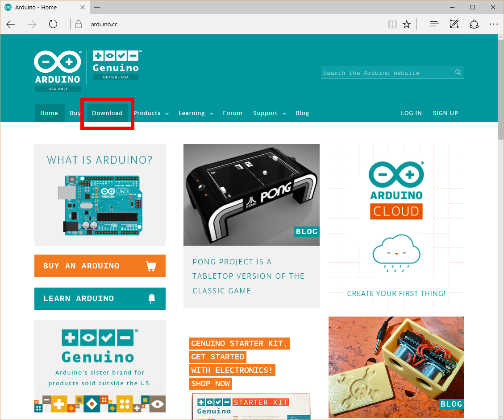
   
  ----
   
1. Download the Arduino Software のページで、Windows Installer をクリックします

  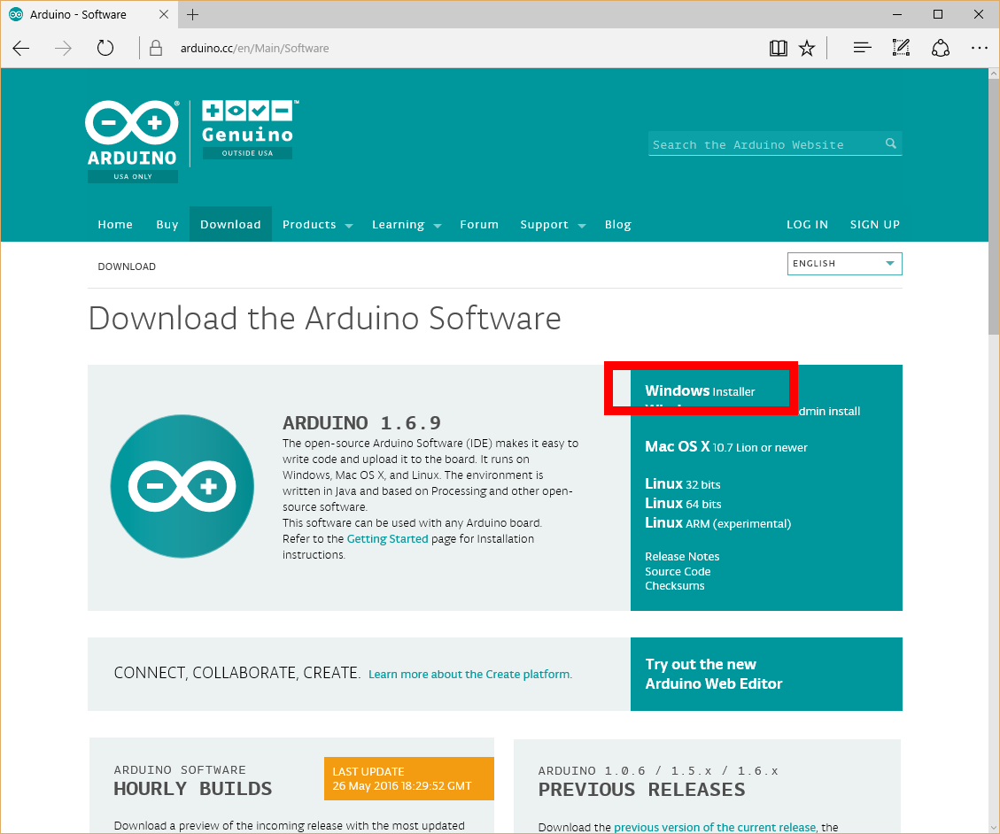
  ----
 
1.  JUST DOWNLOADをクリックして、Installerをダウンロードします

  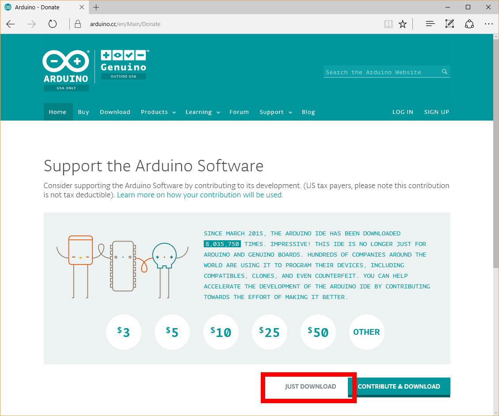
  ----
 
1. ダウンロードしたInstallerをダブルクリックして起動します

1. 旧バージョンのIDEが既にインストールされている場合は、アンインストールしますので、OKを押します

  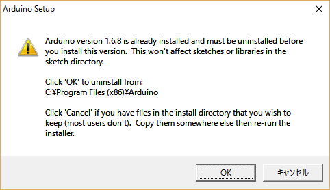
  ----
 
1. アンインストールするファイルの場所を確認して、Uninstallを押します

  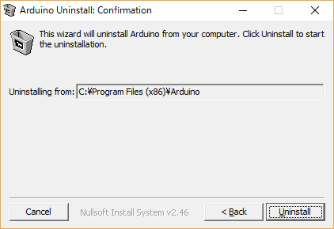
  ----
 
1. 削除の確認画面で、OKを押します

  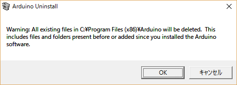
  ----
 
1. アンインストール作業の画面を表示します。Uninstall終了後、Closeを押します

  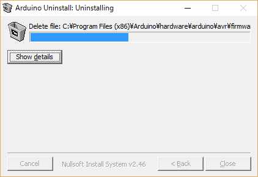
  ----
  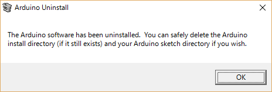
  ----
  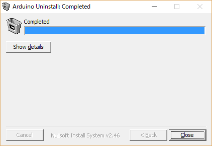
  ----
 
1. arduino IDEをインストールします。I Agreeを押します

  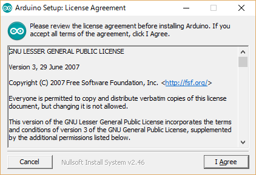
  ----

1. インストールの設定をします。すべてにチェックが入っているか確認して、Nextを押します

  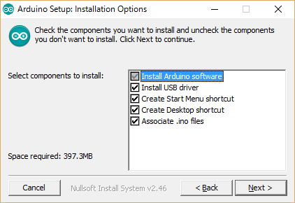
  ----

1. インストールするフォルダを確認して、Installを押します

  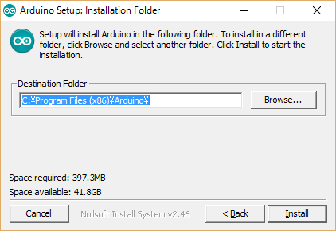
  ----

1. インストール作業の画面を表示します。インストール終了後にCloseを押します

  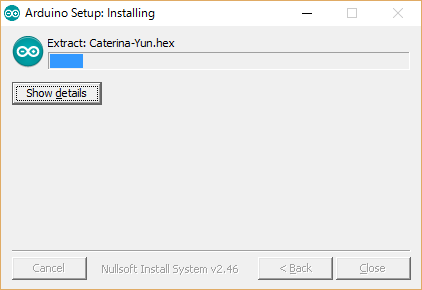
  ----
  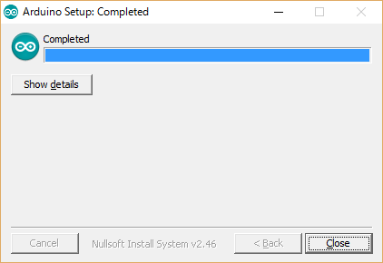
  ----
 
1. デスクトップのArduinoのアイコンをダブルクリックして、IDEを起動します

  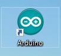
  ----
  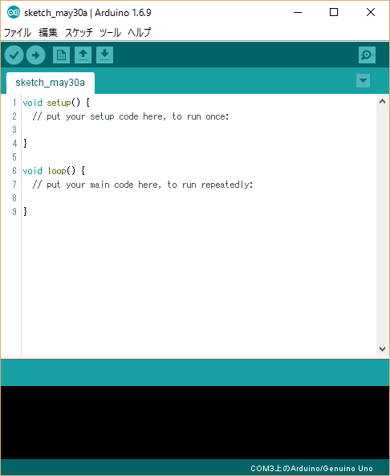
----

[\[目次に戻る\]](../) [\[次に進む\]](../02/)
